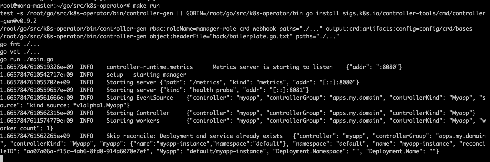
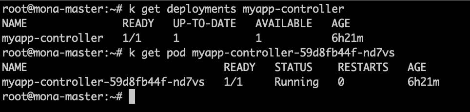
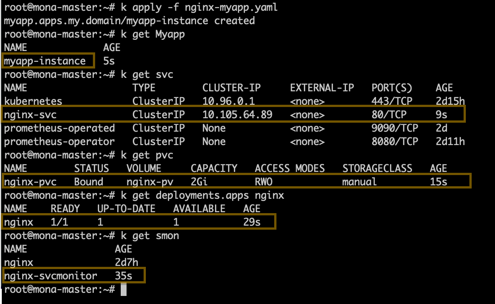

# k8s-Operator

This project is a simple Kubernetes operator to deploy an application (like API) and create every object that this app needs, like service, ingress, persistentvolumeclaim, and secret.
To do this project, first read about these concepts were explained briefly below:

### What is an Operator in Kubernetes?

Operators are software extensions to Kubernetes that use [custom resources](https://kubernetes.io/docs/concepts/extend-kubernetes/api-extension/custom-resources/) to manage applications and their components.

### What is CRD?

The [CustomResourceDefinition](https://kubernetes.io/docs/tasks/extend-kubernetes/custom-resources/custom-resource-definitions/) API resource allows you to define custom resources. Defining a CRD object creates a new custom resource with a name and schema you specify. The Kubernetes API serves and handles the storage of your custom resource.

## Create an Operator

I divided the project into the following parts :

### Part1:  Create a Kubernetes cluster

This cluster has one master and two workers. The cluster has been initialized via  `kubeadm` and used to test and deploy this operator.
This process has been automated via the following ansible:

[HA-KubernetesCluster-Ansible](https://github.com/mona-mp/HA-K8sCluster-ansible)

### Part 2: Creating the Operator Project
There are different ways to create an operator. I would choose the framework Operator-SDK because it is easier to use, and the documentation is easy to read. The Operator SDK is a framework that uses the [controller-runtime](https://github.com/kubernetes-sigs/controller-runtime) library to make writing operators.

#### Prerequisites
The following softwares are required for creating the operator in this way:
- go to version 1.18
```bash
sudo apt update && sudo apt upgrade
sudo apt install wget software-properties-common apt-transport-HTTPS -y
wget https://golang.org/dl/go1.18.linux-amd64.tar.gz
sudo  tar -zxvf go1.18.linux-amd64.tar.gz -C /usr/local/
echo  "export PATH=/usr/local/go/bin:${PATH}"  |  sudo  tee /etc/profile.d/go.sh
source /etc/profile.d/go.sh
```

- gpg‍‍‍‍
```bash
sudo apt install gpg
```
- operator-SDK

Set platform information:
```bash
export ARCH=$(case $(uname -m) in x86_64) echo -n amd64 ;; aarch64) echo -n arm64 ;; *) echo -n $(uname -m) ;; esac)
export OS=$(uname | awk '{print tolower($0)}')
```
Download the binary for your platform:
```bash
export OPERATOR_SDK_DL_URL=https://github.com/operator-framework/operator-sdk/releases/download/v1.24.0
curl -LO ${OPERATOR_SDK_DL_URL}/operator-sdk_${OS}_${ARCH}
```
Import the operator-sdk release GPG key from  `keyserver.ubuntu.com`:
```bash
gpg --keyserver keyserver.ubuntu.com --recv-keys 052996E2A20B5C7E
```
Download the checksums file and its signature, then verify the signature:
```bash
curl -LO ${OPERATOR_SDK_DL_URL}/checksums.txt
curl -LO ${OPERATOR_SDK_DL_URL}/checksums.txt.asc
gpg -u "Operator SDK (release) <cncf-operator-sdk@cncf.io>" --verify checksums.txt.asc
```
Make sure the checksums match:
```bash
grep operator-sdk_${OS}_${ARCH} checksums.txt | sha256sum -c -
```
The output should be like this:
```console
operator-sdk_linux_amd64: OK
```
Install the binary in the PATH:
```bash
chmod +x operator-sdk_${OS}_${ARCH} && sudo mv operator-sdk_${OS}_${ARCH} /usr/local/bin/operator-SDK
```

#### Init the project
Now it is time to use the [Operator SDK](https://sdk.operatorframework.io/) to create the project structure.
```bash
cd go/src/
mkdir k8s-operator && cd k8s-operator
operator-SDK init
```
#### Create the API and the Controller
With the below command, the API and the controller are created:
```bash
operator-SDK create --version v1alpha1 --kind Myapp --resource --controller
```
With these commands, some files create, so what each of them does?

- Makefile: Contains all the necessary commands to generate the artifacts for the operator.
- main.go: The central point of entry to the operator contains the main function.
- controllers/myapp_controller.go: The main logic of the operator goes here.
- api/v1alpha1/myapp_types.go: Contains the structure for the custom resource.

#### Download the dependencies
Use the `tidy` module to remove dependencies we do not need and the `init` module to consolidate packages.
```bash
go mod init
go mod tidy
```
### Part 3: Implement the Operator Logic
When the below CRD is applied, the operator (controller) should create a deployment of Myapp kind with the objects defined in the yaml.
This instance must create a deployment and service for our application, and other objects can be added in the yaml to create, like ingress, secret, PVC, and service monitor.
#### How does each object create?
For each of them, there are two functions:
- ensure[resourcename]: Like ensureService(), ensures Service resource presence in given namespace.
- backend[resourcename]: Like backendService(), it is a code for creating a Secret and setting its required values which are given in the Myapp deployment.

In the myapp_controller.go, the controller knows the existence of each object. It does this through edits to the reconciliation loop function of the  `myapp_controller.go`  file.

#### Deployment and service
By applying the manifest of the kind Myapp, automatically, the deployment of your application and service for it will deploy, so you have to set some values for them. The required values for deployment and service are like that:
```yaml
kind: Myapp
metadata:
  name: <name>
spec:
  name: <app-name> #required
  image: <app-image> #required
  portnumber: <app-port>  #it uses for the container port and svc port and svc targetport
  envs:
    - name: <env-name>
      value: <env-value>
  servicetype: <type-of-svc> #default= cluster-IP.
  servicenodeport: <node-port> #if servicetype is NodePort you can define it
```
#### Ingress
If the application needs to have an ingress,  add these values to the spec of the above manifest:
```yaml
  ingresshost: <host-name>
  ingressclass: <ingressclass-name>
```
The controller checks if these values are set, it calls ensureIngress() and backendIngress() functions to create and connect it to the service.

#### PersistentVolumeClaim
To have a PVC for the application, these values are required :
```yaml
  volumemountpath: <mountPatg> #where to mount this pvc in the pod
  pvcstorage: <storage-size> #like 5Gi
```
If they are set, the PVC will create.
In the deployment,  the Spec.Container.VolumeMounts and Spec.Volume will add to the deployment structure.

#### ServiceMonitor
To create this object, just set the ``servicemonitorenable`` like below:
```yaml
  servicemonitorenable: true
```

#### Secret and ImagepullSecret
If the application need secret, define the Secret key and value in the manifest :
```yaml
  secretkey: <secret-key>
  secretvalue: <secret-value>
```
Create imagepullsecret for dockerhub  by passing the dockerconfigjson like below:
```yaml
  dockerconfigjson: `{"auths":{"https://index.docker.io/v1/":{"username":"<your-username>","password":"<your-pass>","email":"<your-email>","auth":"<auth-value>"}}}`
```
**Notes:**
- To set this value as a string(not map) in the yaml file, you must put it in` `` ` .
 - For the `auth-value`  create a string like `your-username:your-pass` and encode it with base64 algorithms.
- To set `dockerconfigjson` you can use the configuration in `.docker/config.json` .

### Part4:Generating CRDs
Go to the root of the project and generate the CRDs with the command below:
```bash
make manifest
```
It will generate the CRDs for us in this location:

**~/go/src/k8s-operator/config/crd/bases**

### Part 5: Installing the CRDs
There are two ways to register our custom kind schema (`Myapp` in this case) within our Kubernetes cluster. First use `make` :
```bash
make install
```
**Note:**
If you are editing the API definitions, generate the manifests such as CRs or CRDs using:

```sh
make manifests
```

Or navigate to the **~/go/src/k8s-operator/config/crd/bases** and execute this command:
```bash
kubectl apply -f .
```
You can see that the Myapp CRD has been created.
<p align="center">
    
    </p>

### Part6: Spin up the controller
There are two ways to run the controller. For the first one,  navigate to the **~/go/src/k8s-operator/** and build the controller image :
```bash
docker login
docker build  -t monamp10/myapp-controller:1.7.0 .
docker push -t monamp10/myapp-controller:1.7.0
```
After that, deploy it as deployment in the Kubernetes cluster.
**myapp-controller.yaml:**
```yaml
apiVersion: apps/v1
kind: Deployment
metadata:
  name: <controller-name>
  labels:
    app: <controller-name>
spec:
  selector:
    matchLabels:
      app: <controller-name>
  template:
    metadata:
      labels:
        app: <controller-name>
    spec:
      containers:
      - name: <controller-name>
        image: <controller-image> #in my case is "monamp10/myapp-controller:1.7.0"
        ports:
          - name: metrics
            containerPort: 8080
          - name: health-probe
            containerPort: 8081
      imagePullSecrets:
      - name: <secret-name>
      serviceAccount: service-account-admin
```

Alternatively, run the controller in the terminal:
```bash
make run
```
<p align="center">
    
    </p>

### Run the operator in the cluster
Here is an example of using this operator to deploy the Nginx application.
It needs deployment, service, persistentvolumeclaim, ingress, and service monitor.
First, you need to have access to a k8s cluster.
Create the controller with the myapp-controller.yaml:
```yaml
apiVersion: apps/v1
kind: Deployment
metadata:
  name: myapp-controller
  labels:
    app: myapp-controller
spec:
  selector:
    matchLabels:
      app: myapp-controller
  template:
    metadata:
      labels:
        app: myapp-controller
    spec:
      containers:
      - name: myapp-controller
        image: monamp10/myapp-controller:1.7.0
        ports:
          - name: metrics
            containerPort: 8080
          - name: health-probe
            containerPort: 8081
      serviceAccount: service-account-admin
```
Create the controller:
```bash
kubectl apply -f myapp-controller.yaml
```
<p align="center">
    
    </p>

Create the manifest of Myapp kind and give all the values the Nginx app needs. Like below:
```yaml
apiVersion: apps.my.domain/v1alpha1
kind: Myapp
metadata:
  name: myapp-instance
spec:
  name: nginx
  image: nginx:1.23.1
  portnumber: 80
  envs:
    - name: NGINX_HOST
      value: 80
  volumemountpath: /var/log/nginx/error_log
  ingressclass: nginx
  storageclass: manual
  servicemonitorenable: true
```
Create the Myapp resource:
```bash
kubectl apply -f nginx-myapp.yaml
```
<p align="center">
    
    </p>

## challenges :

- To create a service monitor for the application, this error has occurred:
```bash
ERROR Reconciler error {"controller": "myapp",
 "controllerGroup": "apps.my.domain", "controllerKind": "Myapp",
  "myapp": {"name":"myapp-instance","namespace":"default"},
"namespace": "default", "name": "myapp-instance",
"reconcileID": "b6f9fa65-7fb8-4796-a275-b57ec7c6a36e",
 "error": "no kind is registered for the
  type v1.ServiceMonitor in scheme \"pkg/runtime/scheme.go:100\""}
```
It was challenging to solve, so I asked about it in `StackOverflow` and got helpful answers.
Also, this [link](https://www.henryxieblogs.com/2019/08/errorno-kind-is-registered-in-scheme.html) helped too.
Finally, it was solved by adding `monitoring/v1` to the `scheme` in `main.go`:

```go
import (
    "os"
    ctrl "sigs.k8s.io/controller-runtime"
    monitoring "github.com/prometheus-operator/prometheus-operator/pkg/apis/monitoring/v1"
    "k8s.io/apimachinery/pkg/runtime"
)

var (
    scheme = runtime.NewScheme()
)

func init() {
    monitoring.AddToScheme(scheme)
}
```
- When deploying the myapp-controller deployment, the error about its permissions to the cluster and resources had shown, so I found that I did not create a serviceaccount for it, and it caused the problem.
This problem was resolved by creating the serviceaccount and binding it to the cluster-admin role.
```yaml
---
apiVersion: rbac.authorization.k8s.io/v1
kind: ClusterRoleBinding
metadata:
  name: service-account-rolebinding
  namespace: default
subjects:
  - kind: ServiceAccount
    name: service-account-admin
    namespace: default
roleRef:
  kind: ClusterRole
  name: cluster-admin
  apiGroup: rbac.authorization.k8s.io
---
apiVersion: v1
kind: ServiceAccount
metadata:
  name: service-account-admin
  namespace: default
```


- To use `make`, I had not installed it, so when I wanted to use it, I got errors. Installing it resolved the problem:
```bash
apt install make
```
- When running the controller and using ``make install``I got  this error :
 ```bash
usr/local/go/src/net/cgo_linux.go:12:8: no such package located this error resolve by installing gcc.
```
It was solved by installing the gcc:
```bash
apt install gcc
```